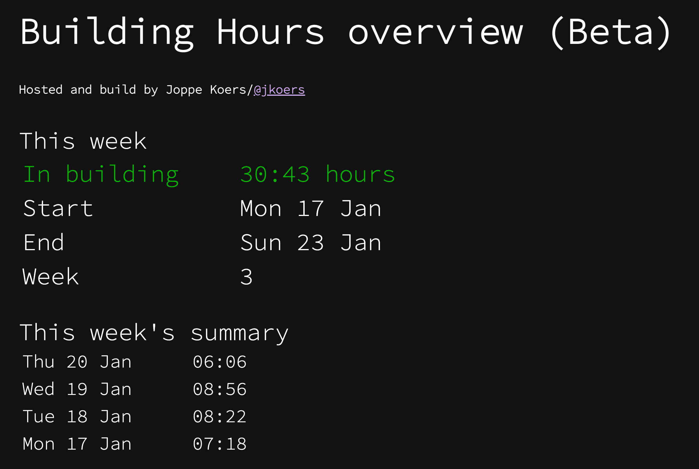
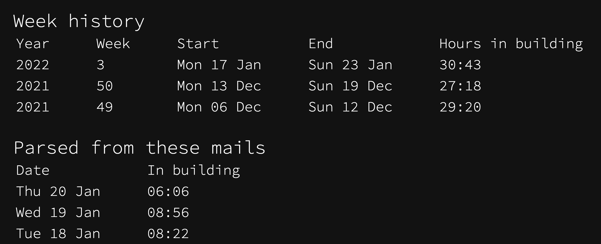

# Codam building time summarizer

Hosted on [hours.joppekoers.nl](https:://joppekoers.nl)

This website summarizes a the logtime report mails in a simple interface

The Codam Coding college has implemented a monitoring system to make sure that students keep engaged with the school.
One of the requirements is that the students be at least 24 hours per week in the building
Every day after you've been in the building Codam sends out a email detailing how many hours you have been inside.
So to make sure you have made this weeks 24 hours, you have to search through your mailbox and manually add the hours together, and who has time for that?
So now you can forward those mails to this website and it will sum the hours for you.

## User process
When a user visits the website for the first time they are prompted to forward their Logtime report mail to the server.
This can be done automatically by using a mail filter. This is explained further on the website
Then when the server receives the first logtime report mail the server will generate a summary.

## Screenshots

